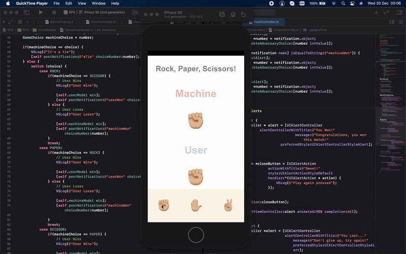

# Paper-Rock-Scissor
A Paper-Rock-Scissor built on UIKit and Objective-C

## Background History

Over the last two months I have been focussing on **iOS Development** with the old but well matured technologies, **ObjectiveC** and **UIKit**. 

Starting and finding good, and most importantly updated, online resources that could help me out to solve exercises was harder than actually creating the set of Apps, due to the fact after **Swift** and **SwiftUI** came out, developers seem to focus on these two other than **ObjectiveC** and **UIkit**.

Because of this, I decided to make some of these projects available on GitHub. Simple ones, but hope they can help newbies getting to know this technology 🤓 This time, a simple game the child in us all loves: **Rock, Paper, Scissors!**

***DISCLAIMER***: I am a beginner with these technologies, perhaps like some of you, so there might be some mistakes here and there. Use this project only as a reference!

